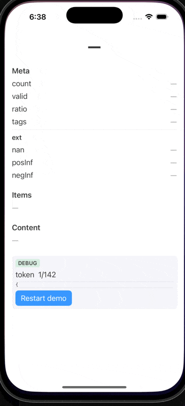

# PartialJSONSwift

> Incremental, tolerant JSON parsing for real‑time LLM streams – in pure Swift

| Built for | Distribution | Minimum OS |
|-----------|--------------|------------|
| Swift 5.9+ / Swift 6 | Swift Package Manager | iOS 13 · macOS 10.15 · tvOS 13 · watchOS 6 |

PartialJSONSwift lets you start working with **in‑flight** JSON fragments before the full payload arrives – perfect for OpenAI, Anthropic, LM Studio, server‑sent events, or any chunked transport where you don’t want to wait for the closing brace.

The library is a faithful Swift port of [promplate/partial-json-parser-js](https://github.com/promplate/partial-json-parser-js) (JavaScript) and its [Python counterpart](https://github.com/promplate/partial-json-parser), with a Swifty API surface and a Combine‑friendly streaming helper.

If you need other languages, check out:

- [JavaScript](https://github.com/promplate/partial-json-parser-js)
- [Python](https://github.com/promplate/partial-json-parser)

---

## Key features

* Incremental parsing — returns the last syntactically valid snapshot at any time.
* Fine‑grained allowances — decide which unfinished constructs (`"string`, `[array`, `{object`, …) are acceptable via the `Allow` option set.
* No Foundation `JSONDecoder` cost — uses a hand‑rolled recursive‑descent scanner.
* Pure Swift, zero dependencies — Combine is optional; you can call `parseJSON()` directly from any thread.
* Thread‑safe and `Sendable` — ready for structured concurrency.

---

## Installation

### Swift Package Manager

Add the dependency to **Package.swift**:

```swift
.package(url: "https://github.com/ItsJustMeChris/PartialJSONSwift.git", from: "1.0.0"),
```

and declare a minimum platform that already ships with Combine:

```swift
platforms: [
    .iOS(.v13),
    .macOS(.v10_15),
    .tvOS(.v13),
    .watchOS(.v6)
]
```

Then add `import PartialJSONSwift` where you need it.

Using Xcode: **File ▸ Add Packages…** and paste the repository URL.

---

## Quick start

### 1 · One‑shot parsing

```swift
import PartialJSONSwift

let partial = "{\"title\": \"Hello" // no closing quote or brace yet

// Accept unfinished strings
let snapshot = try? parseJSON(partial, allow: [.str])
print(snapshot) // ["title": "Hello"]
```

### 2 · Live LLM stream (SwiftUI demo)

```swift
@MainActor
final class ChatStream: ObservableObject {
    @Published private(set) var latest: Any?
    private let parser = PartialJSONStream(allow: [.obj])

    func ingest(_ chunk: String) {
        parser.append(chunk)
        latest = parser.current
    }
}
```

Feed each token you receive — the view updates automatically:

```swift
Text((stream.latest as? [String: Any])?["title"] as? String ?? "…")
```

A complete example is available in **[Examples/StreamingDemo](/Examples/StreamingDemo.swift)**.


---

## API overview

| API | Purpose |
|-----|---------|
| `parseJSON(_ text: String, allow: Allow = .all)` | Synchronously parses the current buffer and returns `Any` (`String`, `NSNumber`, `[Any]`, `[String: Any]`, etc.) or throws `PartialJSONError` / `MalformedJSONError`. |
| `Allow` | Option set controlling which unfinished constructs are tolerated. Combine single cases (`.str`) or groups (`.collection`). |
| `PartialJSONStream` | Combine helper that maintains an internal buffer, calls `parseJSON`, and publishes the last valid snapshot via `@Published var current`. |

All symbols are documented in their source code; use Quick Help in Xcode for inline docs.

---

## FAQ

**Is this a drop‑in replacement for `JSONDecoder`?**  
No — it returns generic `Any` trees so you can start rendering while the JSON grows. Once complete, you can bridge into `Codable` by serialising the snapshot back to `Data`.

**Does it handle `NaN`, `Infinity`, and friends?**  
Yes — enable them with `Allow.special` (disabled by default because strict JSON disallows them).

**What about streaming JSON arrays like `[{…},{…},…]`?**  
Set `allow: [.arr]`; you’ll get the array‑so‑far after each element.

---

## License

MIT — see the `LICENSE` file for details.
